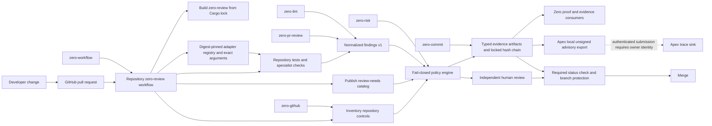

# Review infrastructure topology

This diagram describes source-level integration. A node is not live merely because it appears here.

## Trust boundaries

1. Repository code and PR metadata are untrusted inputs.
2. Adapter output is advisory until normalized and bound to the reviewed head SHA.
3. Apex export is unsigned by default; authenticated submission is owner-gated.
4. A local pass does not prove the hosted workflow or branch-protection rule executed.
5. Human approval remains mandatory for merge; the tool never self-approves.
6. Built-in security pattern results remain `not_proven` for specialist coverage.
7. Override signing, replay protection, and authenticated Apex producer identity remain owner-gated.
