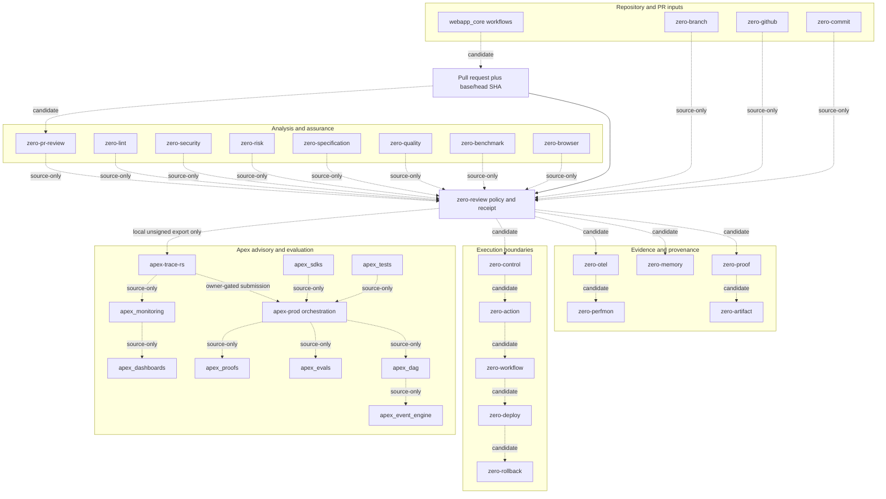

# Zero and Apex review-support ecosystem

The refreshable source inventory is `artifacts/ecosystem-inventory.json`; it currently records filesystem and Git facts only. Every registered root exists, but existence is classified `source_only`, not runtime-ready or integrated.

## Capability topology



## Review-need coverage

| Review need | Primary capability roots | Required future proof |
|---|---|---|
| Change scope and ownership | zero-branch, zero-github, zero-commit | PR metadata bound to immutable base/head SHAs |
| Automated correctness | zero-pr-review, zero-quality, apex_tests | Focused and affected-suite receipts |
| Security | zero-security, zero-lint, zero-risk | Diff/history scan plus reviewed threat-boundary findings |
| Dependencies and supply chain | zero-artifact, apex_sdks, zero-proof | Lockfile, provenance, license, and advisory receipts |
| Data and migrations | zero-risk, zero-rollback, zero-proof | Disposable forward/rollback rehearsal and backup evidence |
| Operations and rollback | zero-control, zero-deploy, zero-rollback | Release plan, approval, health and rollback receipts |
| Observability | zero-otel, zero-perfmon, apex_monitoring | Trace correlation, logs/metrics delta, alert validation |
| Performance | zero-benchmark, zero-perfmon, apex_evals | Reproducible baseline and regression threshold |
| Product, browser and accessibility | zero-browser, zero-pr-review | Deterministic journey and accessibility evidence |
| Privacy and compliance | zero-security, zero-risk, zero-specification | Data-flow, retention, authorization and control mapping |
| Documentation | zero-memory, zero-artifact | Versioned interface/runbook delta or justified no-change |
| Human approval | zero-github, zero-control, apex-trace-rs | Independent reviewer identity and approval bound to head SHA |

## Boundary diagram

```mermaid
sequenceDiagram
  participant Repo as Repository/PR
  participant Review as zero-review
  participant Zero as Zero specialist adapters
  participant Apex as Apex advisory plane
  participant Human as Independent reviewer
  participant GitHub as Merge protection
  Repo->>Review: base SHA, head SHA, changed paths
  Review->>Zero: bounded read-only analysis requests
  Zero-->>Review: normalized findings plus evidence
  Review->>Review: deterministic fail-closed decision
  Review-->>Apex: local unsigned advisory export; submission not active
  Review-->>Human: review packet and unresolved gates
  Human-->>GitHub: approve or request changes
  Review-->>GitHub: required status result
  Note over Apex,GitHub: Signing, submission and protection configuration require owner authority
```
