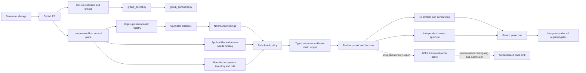
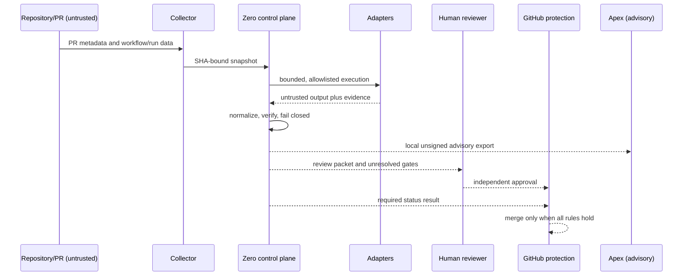
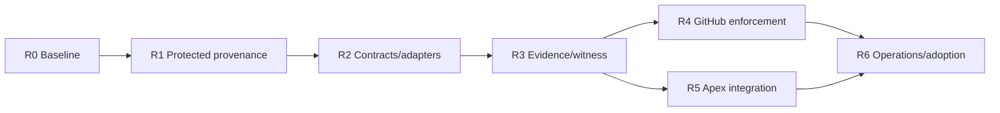

# Zero/Apex review infrastructure and needs roadmap

This is the consolidated source-level map for the current repository. It describes integration contracts and intended boundaries; a node is not proof that a service is deployed or reachable. Current hosted, runtime, release, and Apex claims require fresh receipts.

## Existing topology

## Review-needs coverage

| Need | Existing source contract | Required proof before a pass |
|---|---|---|
| Scope, ownership, base/head binding | `github_collect.py`, PR context schemas | Fresh API snapshot with immutable repository, PR, base, head, author and changed paths |
| Correctness | Rust/Python test harness and adapters | Reproducible focused/affected tests with command, exit code, artifact hash |
| Security and secrets | `security.rs`, security scan, specialist route | Diff/history scan plus specialist security evidence where applicable |
| Dependencies and supply chain | lockfile, release packaging, SBOM | Dependency policy, SBOM, provenance and vulnerability receipts |
| Data/schema/migration safety | risk/applicability contracts | Forward/rollback rehearsal, backup evidence and owner sign-off |
| Operations and rollback | policy and release contracts | Runbook, health, rollback and recovery receipts |
| Observability | evidence model and Apex correlation design | Trace/log/metric correlation and alert validation |
| Performance/capacity | benchmark route and policy | Reproducible baseline, threshold and regression artifact |
| Product/browser/accessibility | applicability catalog | Deterministic journey and accessibility evidence, or explicit not-applicable reason |
| Privacy/compliance | security/risk/specification routes | Data-flow, retention, authorization and control mapping |
| Documentation/supportability | packet/evidence contracts | Versioned runbook/interface delta or justified no-change record |
| Human approval | consumer and branch-protection contract | Current-head approval by an independent authorized reviewer; tool never self-approves |

## Trust boundaries and current gaps

The highest-risk open gaps are: protected-baseline workflow provenance (a PR must not define the evaluator that judges itself), run/workflow identity preservation without path collisions, a current protected tooling release containing the collector/consumer/pin map, post-attestation verification, specialist adapter enrollment, signed packet witnessing, and authenticated Apex producer identity. These are design priorities, not completion claims.

## Refactor roadmap

### R0 — Baseline and evidence hygiene

1. Re-run local Rust/Python/security checks and record a signed, content-addressed baseline.
2. Rebuild the ecosystem inventory and topology; label every node `extracted`, `inferred`, or `owner_gated`.
3. Add a freshness manifest so stale GitHub/Apex receipts cannot be reused.
4. Keep graph generation deterministic when semantic extraction is unavailable; never silently substitute a partial graph for a complete one.

### R1 — Protected evaluation provenance

5. Move evaluator workflow execution to a protected baseline or immutable released workflow.
6. Require collector evidence for `workflow_id`, run id, path, event, head SHA, and referenced workflows.
7. Reject path-only workflow maps and conflicting definitions for the same check.
8. Add adversarial fixtures proving a PR cannot alter its own evaluator or provenance map.

### R2 — Contract and adapter hardening

9. Version one canonical packet contract across Zero and Apex.
10. Enroll each specialist adapter with release digest, exact arguments, timeout, output ceiling, and owner.
11. Normalize `pass`, `fail`, `blocked`, `owner_gated`, and `not_proven` without collapsing states.
12. Add cancellation/idempotency when a PR head changes.

### R3 — Evidence and witnessing

13. Assemble one packet manifest covering every finding, command, artifact hash, tool digest, and reviewed SHA.
14. Add external witness/checkpoint support and replay detection.
15. Add signed overrides with role, expiry, nonce, and immutable PR binding.
16. Add mutation tests for truncation, substitution, stale evidence, and contradictory controls.

### R4 — GitHub release and enforcement

17. Publish a complete checksum-pinned Windows/Linux release from protected main.
18. Verify every artifact attestation against repository, signer workflow, and source tag.
19. Install the consumer workflow from that protected release and prove required-check readback.
20. Require CODEOWNER review for protected infrastructure surfaces where policy demands it.

### R5 — Apex integration

21. Re-probe Apex health and trace sink; document unavailable endpoints as blocked.
22. Register a least-privilege producer identity and signing key under owner control.
23. Submit signed review events with PR/head/tool/reviewer correlation and replay protection.
24. Reconcile Apex evaluations/proofs with the Zero packet without allowing Apex to impersonate approval.

### R6 — Operations and adoption

25. Define SLOs for queue time, review latency, adapter reliability, stale evidence, and override frequency.
26. Add retention, deletion, backup/restore, outage, key compromise, and rollback runbooks.
27. Pilot one repository with named owners and current blocking/pass examples.
28. Expand by capability profile only after fresh receipts, incident paths, and rollback plans exist.

## Gate order

No stage may claim production readiness until its required external receipt exists. Independent human approval, release authorization, protected-branch administration, credential issuance, and authenticated Apex submission remain owner-gated.

## Verification note

`graphify --update` was attempted on 2026-09-05. Structural extraction ran, but semantic extraction failed because the configured Anthropic API credit balance was exhausted; the resulting partial graph is therefore not a complete infrastructure diagram. Re-run with an available semantic backend or use the diagrams above as the deterministic source map.
