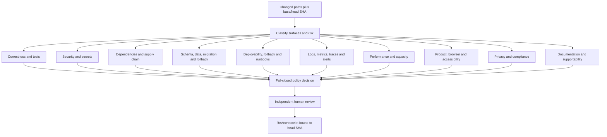

# Review needs

Every PR must produce a review packet bound to its base and head SHA. Applicability is path/risk driven. Change-scope and independent human approval are global controls; correctness, security, dependency, and specialist controls fail closed whenever routing marks them applicable and their evidence is absent.

The machine-readable catalog is produced by `zero-review needs`. Review evidence must include commands, exit codes, artifact paths, and the reviewed SHA; prose-only completion statements are `not_proven`.
