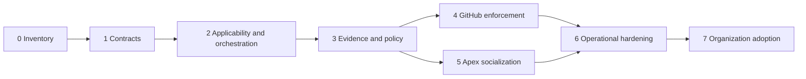

# zero-review roadmap

## Objective

Make every pull request produce a review packet bound to the exact head SHA, covering applicable engineering, security, operational, product, compliance, and human-review needs. The control plane remains fail closed: missing evidence cannot become a pass.

## Stage 0: Inventory baseline

Deliverables:

- Maintain `config/ecosystem-roots.json` as the bounded review-support registry.
- Generate `artifacts/ecosystem-inventory.json` and `artifacts/ecosystem-topology.mmd` with `zero-review ecosystem`.
- Record repository existence, Git identity, Rust workspace presence, and explicit evidence boundaries.
- Add drift tests for missing, renamed, duplicated, or newly relevant roots.

Exit: inventory generation and graph integrity tests pass on a clean checkout. Current state: partial; inventory exists, but full root-drift coverage and a HEAD-fresh snapshot gate remain open. All roots remain `source_only` for capability claims.

## Stage 1: Canonical contracts

Deliverables:

- Version schemas for PR context, findings, applicability, decisions, evidence, overrides, and review packets.
- Require base SHA, head SHA, repository identity, tool release digest, command, exit code, timestamps, and artifact hashes.
- Define stable adapter contracts for zero-pr-review, zero-lint, zero-security, zero-risk, zero-proof, zero-browser, and zero-benchmark.
- Add compatibility fixtures for Apex trace-store and Zero adapters.
- Define redaction, size, timeout, cancellation, and untrusted-output rules.

Exit: contract tests reject stale SHAs, unknown schema versions, unsigned privileged actions, missing evidence, path traversal, and oversized adapter output.

Current state: partial. Applicability and decision schemas, CLI packet validation, signed/replay-safe overrides, evidence-content verification at policy ingestion, and compatibility fixtures remain open.

## Stage 2: Applicability and orchestration

Deliverables:

- Map changed paths and semantic risk to the twelve review-need categories.
- Route only relevant specialist checks while retaining mandatory global controls.
- Execute adapters without a shell, with allowlisted binaries and bounded resources.
- Support cancellation when the PR head changes.
- Migrate each Zero executable to an exact-argument, digest-pinned adapter registry entry.
- Ingest specialist security adapter results without treating the built-in pattern scan as complete coverage.
- Normalize partial, blocked, owner-gated, and not-proven outcomes without collapsing them into success.

Exit: deterministic matrix tests cover application, infrastructure, dependency, migration, security, UI, documentation-only, and mixed changes.

Current state: partial. Deterministic path routing exists; cancellation, registry migration, and specialist execution remain open.

## Stage 3: Evidence and policy engine

Deliverables:

- Bind every finding and decision to the exact PR head SHA and tool digest.
- Extend the hash chain to a signed review-packet manifest when an authorized key is available.
- Detect stale, missing, contradictory, duplicated, or tampered evidence.
- Require explicit owners and expiry for overrides; prohibit self-approval.
- Bind overrides to repository, base/head SHA, tool release digest, signer identity, nonce, and a bounded validity interval; reject replay.
- Assemble and validate review packets through a CLI entrypoint, including decision consistency, required controls, timestamps, and evidence content.
- Emit a single machine-readable merge decision with actionable reasons.

Exit: mutation and fault-injection tests demonstrate fail-closed behavior across evidence corruption, adapter failure, timeout, and policy disagreement.

## Stage 4: GitHub enforcement

Deliverables:

- Publish checksum-pinned Windows and Linux artifacts through an authorized release channel.
- Run `zero-review` for every pull-request lifecycle event.
- Upload the review packet and diagrams as workflow artifacts.
- Publish concise check annotations without exposing secrets or personal data.
- Configure `zero-review` as a required status check and read the protection rule back through zero-github.
- Invalidate approvals when the reviewed head changes and require CODEOWNER review for protected surfaces.
- Prove hosted artifact upload and required-check readback on the intended repository.

Exit: a hosted PR run on the intended repository and workflow revision produces a valid packet; branch-protection readback proves merge is blocked when the check or human approval is absent. Owner-gated until release and repository settings are authorized.

## Stage 5: Apex socialization

Deliverables:

- Register a least-privilege Apex producer identity for review events.
- Sign review outcome events and submit them to the authenticated trace sink.
- Bind release provenance to the checksum of the executed binary rather than a package-version constant.
- Route advisory evaluation through apex_evals and proof reconciliation through apex_proofs.
- Correlate PR, workflow, adapter, finding, decision, reviewer, and merge events.
- Publish operational views through apex_monitoring and apex_dashboards.
- Keep Apex advisory: it may recommend or escalate, but cannot impersonate human approval or mutate a PR without explicit policy and authority.

Exit: authenticated trace round-trip, schema validation, replay protection, dashboard readback, and failure-mode alerting are verified. Current Apex endpoint availability must be re-probed before work.

## Stage 6: Operational hardening

Deliverables:

- Add SLOs for review latency, queue time, adapter reliability, stale evidence, and false-positive disposition.
- Add durable storage, retention/deletion policy, backup/restore rehearsal, and disaster recovery.
- Add concurrency controls, deduplication, idempotency, rate limits, and backpressure.
- Add dependency and release provenance, SBOMs, vulnerability scanning, and reproducible builds.
- Provide operator runbooks for stuck reviews, compromised keys, unavailable adapters, GitHub outages, and Apex outages.

Exit: bounded load, recovery, tamper, and dependency-compromise exercises produce current receipts; operational owners accept the runbooks.

## Stage 7: Organization-wide adoption

Deliverables:

- Create reusable workflow templates and per-language capability profiles.
- Pilot on one repository, then expand by measured cohorts.
- Train authors, reviewers, security, data, operations, and repository administrators.
- Track override volume, escaped defects, review latency, flaky controls, and evidence freshness without using vanity pass-rate targets.
- Establish quarterly policy review and adapter retirement/versioning procedures.

Exit: each adopted repository has a named owner, required-check readback, current successful and blocking examples, incident path, and rollback plan.

## Dependency order

## Decision gates

- No hosted rollout before checksum-pinned release artifacts exist.
- No required-check claim before branch-protection readback.
- No Apex submission before producer identity, signing, and replay policy are authorized.
- No merge approval may be generated by the tool itself.
- No production/deployment claim may be inferred from source, local tests, diagrams, or an Apex advisory event.
